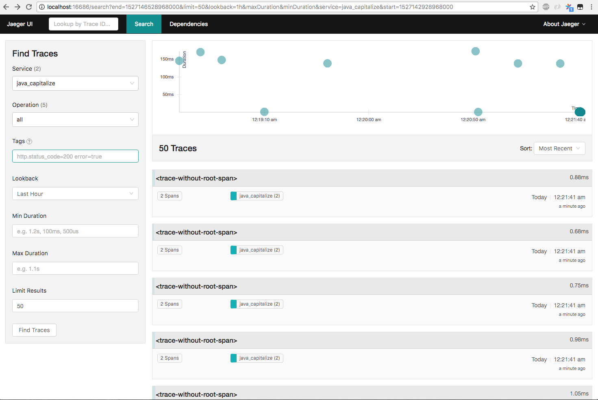
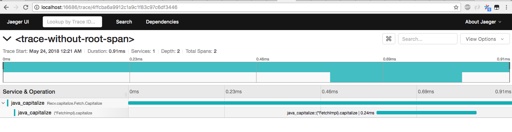
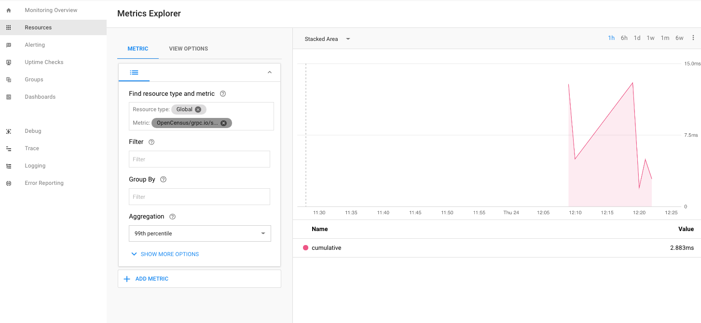
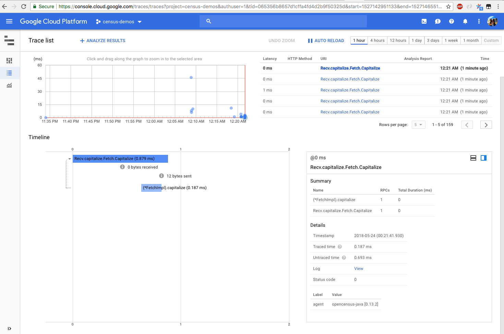

# opencensus-for-grpc-java-developers
OpenCensus for gRPC Java developers

## Installing dependencies

Requires maven and Java 6+

```shell
mvn install
```

### Environment variables

Name|Notes
---|---
Jaeger|Install Jaeger with the Docker image as per https://www.jaegertracing.io/docs/getting-started/#all-in-one-docker-image
GOOGLE_APPLICATION_CREDENTIALS|A file containing Google Cloud Platform project credentials. If you don't have one yet installed, please visit https://cloud.google.com/docs/authentication/production

## Running the setup

Assuming you successfully ran the `Installing dependencies` step
```shell
mvn exec:java -Dexec.mainClass=io.ocgrpc.capitalize.CapitalizeServer
```

In another terminal
```shell
mvn exec:java -Dexec.mainClass=io.ocgrpc.capitalize.CapitalizeClient
```

which will give an interactive shell in which you can type and on hitting
enter, you'll get results like this

```shell
> truly
< TRULY

> gist
< GIST

> first
< FIRST

> one
< ONE

> there
< THERE

> 🚀 a1 a4
< 🚀 A1 A4
```

### Results




